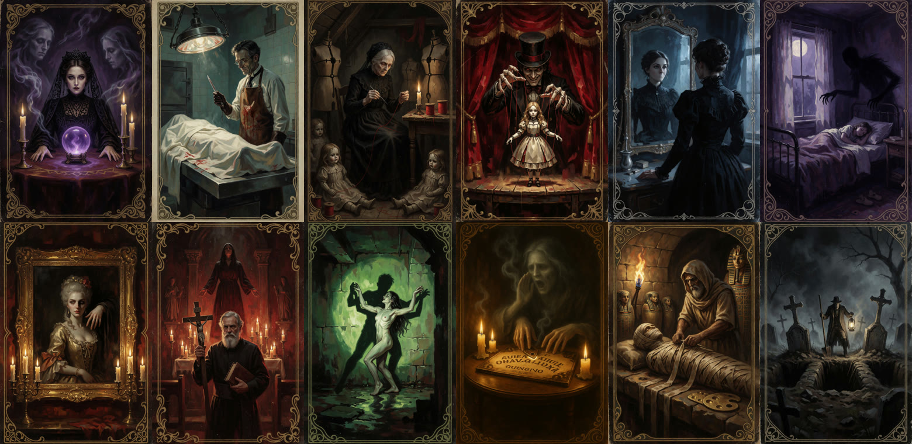

# 🏚 La Casa Maldita (The Cursed House)

**Twelve horror rooms for ComfyUI.** Each room is a workflow with its own themed panel: pick an option, drop in your image or
video, press one button… and the character who lives there does the rest. With a lobby, original music and voices.

*Versión en español: [README.md](README.md). The panel itself is in Spanish.*



## The rooms

| # | Room | What it does | Engine |
|---|---|---|---|
| 01 | 🔮 **La Médium** (The Medium) | You describe a scene and she "sees" it: text → image | Krea 2 Turbo |
| 02 | 🩻 **El Forense** (The Coroner) | Upscales and restores an image | SeedVR2 3B |
| 03 | 🧵 **La Costurera** (The Seamstress) | Inpaints an area: paint the mask and say what to stitch in | Z-Image Turbo |
| 04 | 🎭 **El Marionetista** (The Puppeteer) | Copies the pose, outline or depth of a figure into a new character | SDXL + ControlNet Union |
| 05 | 🪞 **El Doppelgänger** | Puts your character somewhere else, doing something else | FLUX.2 Klein 4B |
| 06 | 🌘 **La Pesadilla** (The Nightmare) | Text → video with sound | LTX 2.5 |
| 07 | 🖼 **El Retrato** (The Portrait) | Brings an image to life: image → video with sound | LTX 2.5 |
| 08 | ✝ **El Exorcista** (The Exorcist) | A full scene with voice and sound from a character reference | MiniMax H3 ¹ |
| 09 | 🕺 **El Poseso** (The Possessed) | Transfers the motion of a video to your character | Wan SCAIL-2 |
| 10 | 🔤 **La Ouija** | Makes a photo talk with an audio clip | MiniMax H3 ¹ · Wan HuMo |
| 11 | ⚱ **El Embalsamador** (The Embalmer) | Enhances and upscales a video | SeedVR2 7B |
| 12 | ⚰ **El Sepulturero** (The Gravedigger) | Joins several videos with transitions | (no models) |

Rooms hand work to each other: from a Medium image you can send it to the morgue, the mirror, the gallery… without
downloading or re-uploading anything.

¹ Read the [note about MiniMax H3](#note-about-minimax-h3).

## Requirements

- **ComfyUI 0.37 or newer** (native support for SCAIL-2, MiniMax H3, LTX 2.5 and Krea 2).
- **16 GB VRAM GPU** and **32 GB RAM**. Tested on an RTX 5070 Ti.
- **Disk:** about 186 GB for the models of all 12 rooms. You can install only the rooms you want.

## Installation

1. **Clone the House** into `ComfyUI/custom_nodes`:
   ```bash
   cd ComfyUI/custom_nodes
   git clone https://github.com/TU_USUARIO/la-casa-maldita casa_maldita
   ```
2. **Install the custom nodes** the rooms use. The easiest way is to open any room and use
   *ComfyUI-Manager → Install Missing Custom Nodes*. Full list:

   | Node | Rooms |
   |---|---|
   | [ComfyUI-SeedVR2_VideoUpscaler](https://github.com/numz/ComfyUI-SeedVR2_VideoUpscaler) | 02, 11 |
   | [ComfyUI-KJNodes](https://github.com/kijai/ComfyUI-KJNodes) | 03, 08, 12 |
   | [comfyui_controlnet_aux](https://github.com/Fannovel16/comfyui_controlnet_aux) | 04 |
   | [ComfyUI-Impact-Pack](https://github.com/ltdrdata/ComfyUI-Impact-Pack) | 04 |
   | [ComfyUI-GGUF](https://github.com/city96/ComfyUI-GGUF) | 06, 07 |
   | [ComfyUI-MiniMax-H3-Turbo](https://github.com/Larryvrh/ComfyUI-MiniMax-H3-Turbo) | 08, 10 |
   | [ComfyUI-Frame-Interpolation](https://github.com/Fannovel16/ComfyUI-Frame-Interpolation) | 08, 09 |
   | [ComfyUI-Easy-Use](https://github.com/yolain/ComfyUI-Easy-Use) | 08 |
   | [ComfyUI-SCAIL2-Easy](https://github.com/nkxx188/ComfyUI-SCAIL2-Easy) | 09 |
   | [ComfyUI-VideoHelperSuite](https://github.com/Kosinkadink/ComfyUI-VideoHelperSuite) | 09 |

3. **Download the models** for the rooms you want: folders, sizes and links in **[MODELS.md](MODELS.md)**.
   If something is missing, the room tells you when you enter it, with the download link.
4. **Restart ComfyUI** and reload the browser (Ctrl+F5).

## How to use it

- Press the **🏚 LA CASA** button (bottom right) to open **the lobby** with the twelve doors.
- Pick a door. Click the portrait on the cover to enter.
- Fill in the panel (image, video or text; prompts work best in English) and press the big button.
- **🔊 Voz** and **🔊 Música** mute the narrator or the music separately.
- **👁 Ver las entrañas** ("see the guts") shows the ComfyUI workflow underneath, in case you want to tinker.

The workflows also show up in ComfyUI's template browser, under *casa_maldita*.

## Licenses

- **The House's code, workflows, posters, music and voices:** [GPL-3.0](LICENSE), same as ComfyUI.
- **Models:** each has its own license; you download them yourself from their official pages and accept their terms.
  Summary and links in [LICENCIAS.md](LICENCIAS.md) (Spanish).
- All the House's art, music and voices are **AI-generated**.

### Note about MiniMax H3

El Exorcista (08) and La Ouija's "Hablar la foto" mode (10) use **MiniMax H3**. Its license
([MiniMax H3 Community License](https://huggingface.co/MiniMaxAI/MiniMax-H3/blob/main/LICENSE)) **does not cover the European
Union, the United Kingdom, South Korea or the USA**: if you live there, check the terms with MiniMax before using it. It also
asks you to show "Powered by MiniMax H3" and to disclose that the content is AI-generated. This repository ships no models.

## Credits

- Models: Krea, ByteDance-Seed (SeedVR2, HuMo), Tongyi-MAI (Z-Image), RunDiffusion (Juggernaut XL), xinsir (ControlNet Union),
  Black Forest Labs (FLUX.2 Klein), Lightricks (LTX 2.5), MiniMax (H3), Zhipu AI (SCAIL-2), Wan-AI, Meta (SAM 3.1), and the
  people who publish the quantized files linked in [MODELS.md](MODELS.md).
- Nodes: the authors in the installation table, and the ComfyUI team.
- Music: made with [ACE-Step 1.5](https://github.com/ace-step/ACE-Step). Voices: ElevenLabs (commercial-license plan).

Made by **gustaafvito.creador.ia**.
